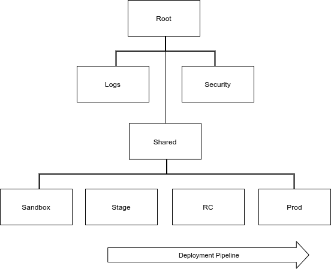
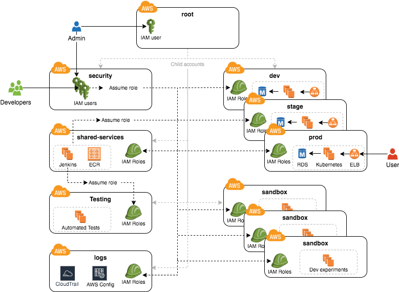

# NewLink Terraform

This repository contains the terraform codebase for newlink.


# Architecture

This repository follows the best practices outlined in the [AWS Landing Zone](https://aws.amazon.com/solutions/implementations/aws-landing-zone/) documentation and is implemented using the popular Infrastructure as Code tool, [Terraform](https://www.terraform.io/).

[AWS Control Tower](https://aws.amazon.com/controltower/) is used to manually setup and govern a secure, multi-account AWS environment.

[AWS Control Tower Account Factory for Terraform](https://docs.aws.amazon.com/controltower/latest/userguide/aft-getting-started.html) is used to provision additional organization accounts after the initial multi-account environment is online. The terraform module can be [downloaded here](https://github.com/aws-ia/terraform-aws-control_tower_account_factory).

Terraform `modules` and `environments` are modeled using the `terraservices` pattern introduced in the [5 Common Terraform Patterns](https://www.hashicorp.com/resources/evolving-infrastructure-terraform-opencredo) introduced during the Hashiconf 2019 conference.

This repository is considered the "system that builds the system" or the "infrastructure that manages the infrastructure" as mentioned in the final segment of the [5 Common Terraform Patterns](https://www.hashicorp.com/resources/evolving-infrastructure-terraform-opencredo) talk mentioned above.

Once the organization has been bootstrapped, terraform modules can be added directly to published environments.

# AWS Control Tower

When creating a new account, be sure to choose 2 regions for governance so the AFT module is able to create the secondary region where state tracking and internal data can be replicated.

The [Overview of AWS Control Tower Account Factory for Terraform](https://docs.aws.amazon.com/controltower/latest/userguide/aft-overview.html) provides a detailed walk-through on how to deploy AFT.

Following the successful deployment of AFT, follow the [Post-deployment steps](https://docs.aws.amazon.com/controltower/latest/userguide/aft-post-deployment.html) to set up the [four repositories](https://github.com/aws-ia/terraform-aws-control_tower_account_factory/tree/main/sources/aft-customizations-repos) that manage account requests and provisioning customizations.

## AWS SSO and AWS CLI

The AWS CLI needs to be configured to use the SSO user created by Control Tower before it or Terraform can be used. See the [Configuring the AWS CLI to use AWS Single Sign-On](https://docs.aws.amazon.com/cli/latest/userguide/cli-configure-sso.html) for details.


## Environment Hierarchy



An `environment` is a terraform IaC module responsible for a given AWS account within the multi-account organization. This repository contains `core` and `application` environments / accounts.

`Core` environments are:

1. Root
2. Security
3. Logs
4. Shared

`Application` environments are:

1. Stage
2. Pre-Prod
3. Prod
4. Sandbox

When bootstrapping a new environment, the `core` environments must be deployed first, followed by the `application` accounts.

#### Publishing Modules

The modules contained in this repository are "published" to the shared account CodeCommit repository

## Application Environments

CropDroid uses the following application environments:

1. Stage: Where manual and automated testing is performed against code merged to master
2. Prod: Live customer environment
3. Sandbox: Ephemeral, isolated environments for testing


## AWS Accounts



### The root account

At the top of the design, you have the root account of your AWS organization. This account is not used to run any infrastructure, and only one or a small number of trusted admins should have IAM users in this account, using it solely to create and manage child accounts and billing.

Do NOT attach any IAM policies directly to the IAM users; instead, create a set of IAM groups, with specific IAM policies attached to each group, and assign all of your users to the appropriate groups. The exact set of IAM groups you need depends on your company’s requirements, but for most companies, the root account contains solely a full-access IAM group that gives the handful of trusted users in that account admin permissions, plus a billing IAM group that gives the finance team access to the billing details.

### Security account

You will want a single security account for managing authentication and authorization. This account is not used to run any infrastructure. Instead, this is where you define all of the IAM users and IAM groups for your team (unless you’re using Federated auth, as described later). None of the other child accounts will have IAM users; instead, those accounts will have IAM roles that can be assumed from the security account. That way, each person on your team will have a single IAM user and a single set of credentials in the security account (with the exception of the small number of admins who will also have a separate IAM user in the root account) and they will be able to access the other accounts by assuming IAM roles.

### Application accounts (stage, rc, prod)

You can have one or more application accounts for running your software. At a bare minimum, most companies will have a production account ("prod"), for running user-facing software, and a staging account ("stage") which is a replica of production (albeit with smaller or fewer servers to save money) used for internal testing. Some teams will have more pre-prod environments (e.g., dev, qa, uat) and some may find the need for more than one prod account (e.g., a separate account for backup and/or disaster recovery, or separate accounts to separate workloads with and without compliance requirements).

### Shared services account

The shared-services account is used for infrastructure and data that is shared amongst all the application accounts, such as CI servers and artifact repositories. For example, in your shared-services account, you might use ECR to store Docker images and Jenkins to deploy those Docker images to dev, stage, and prod. Since the shared-services account may provide resources to (e.g., application packages) and has access to most of your other accounts (e.g., for deployments), including production, from a security perspective, you should treat it as a production account, and use at least the same level of precaution when locking everything down.

### Sandbox accounts

You may want to have one or more sandbox accounts that developers can use for manual testing. The application accounts (e.g., dev and stage) are usually shared by the whole company, so these sandbox accounts are intentionally kept separate so that developers can feel comfortable deploying and undeploying anything they want without fear of affecting someone else (in fact, the gold standard is one sandbox account per developer to keep things 100% isolated).

### Testing accounts

One other type of account that often comes in handy is a testing account that is used specifically for automated tests that spin up and tear down lots of AWS infrastructure. For example, at Gruntwork, we use Terratest to test all of our infrastructure code, and when testing something like our Vault modules, we end up spinning up and tearing down a dozen Vault and Consul clusters after every single commit. You don’t want all this infrastructure churn in your application or sandbox accounts, so we recommend having a separate AWS account dedicated for automated tests.

### Logs account

You will want a single logs account for aggregating log data. All the other accounts—root, security, application accounts, shared-services, etc.—will send their AWS Config and CloudTrail data to this account so that you have a single, central place where all logs are stored and can be viewed. This account will also contain a KMS customer master key (CMK) that is used to encrypt CloudTrail logs.

Note that for larger organizations with multiple separate business units, you may need to repeat the structure above multiple times. That is, in the root account, you create an Organization Unit for each business unit, and within each Organization Unit, you create a set of application, shared-services, sandbox, and testing accounts (security and logs accounts are usually shared across the entire organization). It’s not unusual for large organizations to have dozens or even hundreds of AWS accounts.


## IAM Roles

An IAM role is a standalone IAM entity that (a) allows you to attach IAM policies to it, (b) specify which other IAM entities to trust, and then (c) those other IAM entities can assume the IAM role to be temporarily get access to the permissions in those IAM policies. The two most common use cases for IAM roles are:

### Service roles

Whereas an IAM user allows a human being to access AWS resources, one of the most common use cases for an IAM role is to allow a service—e.g., one of your applications, a CI server, or an AWS service—to access specific resources in your AWS account. For example, you could create an IAM role that gives access to a specific S3 bucket and allow that role to be assumed by one of your EC2 instances. The code running on that EC2 instance will then be able to access that S3 bucket without you having to manually copy AWS credentials (i.e., access keys) onto that instance.

### Cross account access

Another common use case for IAM roles is to grant an IAM entity in one AWS account access to specific resources in another AWS account. For example, if you have an IAM user in account A, then by default, that IAM user cannot access anything in account B. However, you could create an IAM role in account B that gives access to a specific S3 bucket in account B and allow that role to be assumed by an IAM user in account A. That IAM user will then be able to access the contents of the S3 bucket by assuming the IAM role in account B. This ability to assume IAM roles across different AWS accounts is the critical glue that truly makes a multi AWS account structure possible.

### Assuming an IAM role

IAM roles do not have a user name, password, or permanent access keys. To use an IAM role, you must assume it by making an AssumeRole API call (see the AssumeRole API and assume-role CLI command), which will return temporary access keys you can use in follow-up API calls to authenticate as the IAM role. The temporary access keys will be valid for 1-12 hours, depending on IAM role settings, after which you must call AssumeRole again to fetch new keys. Note that to make the AssumeRole API call, you must first authenticate to AWS using some other mechanism. For example, for an IAM user to assume an IAM role, the workflow looks like this:


The basic steps are:

1. Authenticate using the IAM user’s permanent AWS access keys
2. Make the AssumeRole API call
3. AWS sends back temporary access keys
4. You authenticate using those temporary access keys
5. Now all of your subsequent API calls will be on behalf of the assumed IAM role, with access to whatever permissions are attached to that role

To [assume a role using the AWS console](https://docs.aws.amazon.com/IAM/latest/UserGuide/id_roles_use_switch-role-console.html), click on the account number on the upper right section of the AWS console.

## Networking

### Route53
This repository has a manual dependency on the top-level DNS domain `onelink-edge.com` which currently resides in the `onelinkdev` AWS account `515433170249`.

### Subnets

CropDroid delegates the `10.0.0.0/8` subnet to this AWS organization. The /8 has been divided into /16 networks for VPCs as follows:

```
10.204.0.1 - 10.204.15.254
10.204.16.1 - 10.204.31.254
10.204.32.1 - 10.204.47.254
10.204.48.1 - 10.204.63.254
10.204.64.1 - 10.204.79.254
10.204.80.1 - 10.204.95.254
10.204.96.1 - 10.204.111.254
10.204.112.1 - 10.204.127.254
10.204.128.1 - 10.204.143.254
10.204.144.1 - 10.204.159.254
10.204.160.1 - 10.204.175.254
10.204.176.1 - 10.204.191.254
10.204.192.1 - 10.204.207.254
10.204.208.1 - 10.204.223.254
10.204.224.1 - 10.204.239.254
10.204.240.1 - 10.204.255.254
```

| Account Name | AWS Account ID | CIDR | Network Range |
| :-- | :--  | :-- | :-- |
| root       | [883962796102](http://signin.aws.amazon.com/switchrole?account=883962796102&roleName=mgmt-admins) | 10.204.0.0/20   | `10.204.0.1 - 10.204.15.254` |
| security   | [029621062858](http://signin.aws.amazon.com/switchrole?account=029621062858&roleName=devops-security) | 10.204.16.0/20  | `10.204.16.1 - 10.204.31.254` |
| logs       | [178682614982](http://signin.aws.amazon.com/switchrole?account=178682614982&roleName=devops-logs) | 10.204.32.0/20  | `10.204.32.1 - 10.204.47.254` |
| shared     | [195741991018](http://signin.aws.amazon.com/switchrole?account=195741991018&roleName=devops-shared) | 10.204.48.0/20  | `10.204.48.1 - 10.204.63.254` |
| stage      | [379420284410](http://signin.aws.amazon.com/switchrole?account=379420284410&roleName=devops-stage) | 10.204.64.0/20  | `10.204.64.1 - 10.204.79.254` |
| rc         | [668707402856](http://signin.aws.amazon.com/switchrole?account=668707402856&roleName=devops-rc) | 10.204.80.0/20  | `10.204.80.1 - 10.204.95.254` |
| prod       | [359614849963](http://signin.aws.amazon.com/switchrole?account=359614849963&roleName=devops-prod) | 10.204.96.0/20  | `10.204.96.1 - 10.204.111.254` |
